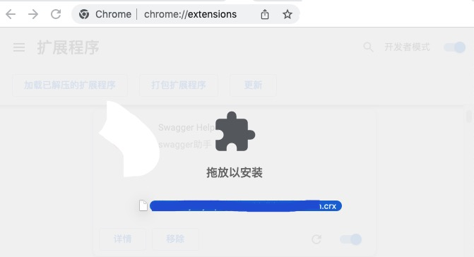
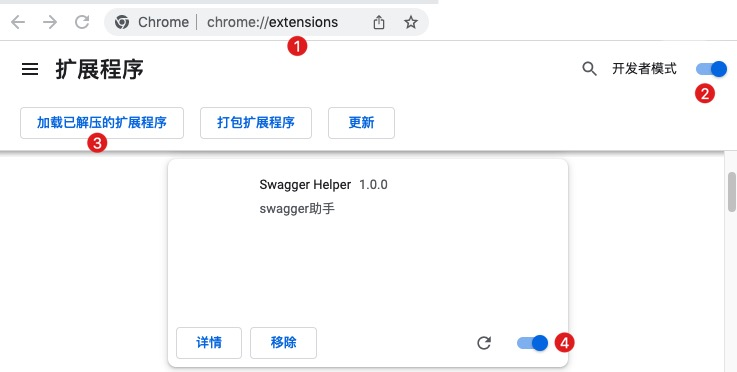

# swagger-helper

swagger 助手

## 安装

- 方法一 （**推荐**）

  从[Chrome商店](https://chrome.google.com/webstore/category/extensions)安装

- 方法二

  将`.crx`文件下载下来后，直接拖入Chrome

  

- 方法三

  下载项目源码，解压后导入Chrome

  
